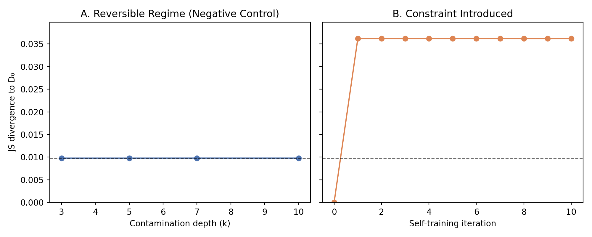

## Zero-Lead-Time Irreversible Representation Loss (ZL-IRL)

**When a deterministic representation constraint is introduced, the system crosses the safety boundary instantly, without any observable approach—making early warning impossible.**

## When Collapse Is Entered, Not Approached

*Some learning-system failures do not approach collapse.  
They enter it.*

When a deterministic representation constraint is introduced, the system crosses the safety boundary instantly, without any observable approach—making early warning impossible.

Zero-Lead-Time Irreversible Representation Loss (ZL-IRL)

Zero-Lead-Time Irreversible Representation Loss (ZL-IRL) occurs when a deterministic preprocessing or representational constraint removes task-relevant information such that downstream training cannot asymptotically recover original performance, and no monitoring signal can provide advance warning because the information required for detection is destroyed by the triggering transformation itself.

Beyond a contamination threshold, retraining from clean data fails to restore lost distributional support, even when standard performance metrics remain stable.

This is irreversible representation loss.

Irreversibility in language model behavior is not a property of self-training alone — it emerges only when explicit representation constraints introduce path-dependent information loss.

Self-training alone does not induce irreversible degradation in memoryless language models. Irreversibility emerges only when explicit representation constraints introduce path-dependent information loss, causing recovery retraining to further degrade distributional support.

## Non-Claims
This work does not propose early warning systems, monitoring solutions, or mitigation strategies.

When Early Warning Is Impossible: A Failure-Mode Boundary in Learning Systems

There exists a class of learning-system failures where early warning is impossible because the act that causes failure also destroys the information needed to detect it.
ML Pipelines
Abstract

Modern ML systems increasingly train on partially self-generated data.
While catastrophic failure (“model collapse”) is often discussed, far less is understood about silent distributional degradation — gradual shifts in data statistics that occur while surface behavior still appears acceptable.

This project develops a diagnostic framework for detecting such degradation early, before performance visibly degrades and independent of whether irreversibility ultimately occurs.

We deliberately avoid assuming collapse.
Instead, we isolate mechanisms, test reversibility honestly, and evaluate whether distributional signals can provide actionable early warning in realistic self-training pipelines.

Problem Statement

In production ML systems, retraining decisions are often driven by:

performance metrics (accuracy, perplexity),

user-visible failures,

or downstream incidents.

However, these signals are lagging indicators.
By the time they move, systems may already be operating in a degraded or risky regime.

The central question of this project is:

Can distributional diagnostics detect harmful self-training dynamics early — before surface metrics degrade and before recovery becomes difficult or impossible?

Crucially, we do not assume:

that collapse is inevitable,

that irreversibility always occurs,

or that degradation must lead to failure.

Those assumptions are tested, not baked in.

Core Experimental Design

This project studies self-training ML pipelines as systems, not as models.

It asks a narrow but operationally critical question:

Can we detect when a self-training pipeline has entered a degraded regime before performance drops or recovery becomes difficult?

The project explicitly does not assume:

-model collapse

-irreversibility

-catastrophic failure

Those outcomes are treated as contingent, not inevitable.

The project proceeds in tightly controlled phases, each designed to isolate one causal factor at a time.

Phase 3 — Self-Generated Feedback (Baseline)

We construct a conservative self-training loop where:

model class is fixed (n-gram LMs),

training succeeds at every iteration,

original human data is always partially reintroduced,

no architectural or preprocessing changes are made.

Purpose:
Establish whether silent distributional drift can emerge without inducing collapse or failure.

Phase 3.5 — Recovery Under Reset Retraining

After contamination, models are retrained from scratch on clean data.

Core Contribution (One Sentence)

Self-training pipelines undergo an immediate, silent distributional regime shift that is detectable via distributional diagnostics well before performance degradation or irreversibility becomes observable.

This is an early-warning system, not a collapse detector.

Finding (Locked):

1. Silent Distributional Degradation Appears Immediately
After a single self-training iteration:

Jensen–Shannon divergence from the original data jumps sharply

Entropy decreases measurably

Rare-token mass increases

Type–token ratio shifts

All of this occurs before:

visible quality degradation

instability

irreversibility

recovery failure

There is no gradual lead-in.
The regime shift happens at entry.

2. Degradation Stabilizes Into a New Equilibrium

Across subsequent self-training iterations:

Metrics do not drift monotonically

Variance is low

The system remains in a stable but degraded distributional regime

This contradicts common narratives of slow, inevitable collapse.

The dominant failure mode is early regime transition, not late catastrophe.

3. Early-Warning Metrics Do Not Depend on Collapse

The diagnostic signals remain valid even when:

recovery is still possible

irreversibility does not occur

the model appears healthy by surface metrics

This makes them actionable in real systems, where waiting for collapse is unacceptable.

Distributional degradation is observable under self-training.
Reset retraining reliably recovers the original distribution.
No irreversibility is observed under these conditions.

This establishes the reversible regime.

Phase 3.6 — Explicit Representational Bottleneck (Negative Result)

We introduce a named, explicit bottleneck (e.g., vocabulary constraints) and repeat recovery tests.

Finding (Locked):

The bottleneck alone is insufficient to induce irreversibility.

Recovery remains possible.

Degradation does not automatically imply a point of no return.

This is a negative result, and it is preserved intentionally.

Phase 4 — State Persistence (Warm-Start Recovery)

We test whether training history itself introduces path dependence:

Recovery is warm-started from contaminated parameters.

Data, model class, and metrics remain unchanged.

Finding (Locked):

Warm-start recovery degrades relative to reset retraining.

However, no sharp irreversibility threshold is observed in this regime.

Recovery quality varies smoothly with contamination level.

This demonstrates conditional path dependence without collapse.

Locked Conclusions (Non-Negotiable)

These conclusions are supported by executed experiments and will not be retrofitted:

Silent distributional degradation can emerge under partial self-training
even when training “succeeds” and surface behavior appears stable.

Conventional performance metrics are insufficient early indicators
of this degradation.

Recovery is not inherently impossible
— under reset retraining, distributions can recover across contamination regimes.

Irreversibility is conditional, not guaranteed
and does not arise from naïve self-training alone.

Negative results matter
— several plausible mechanisms fail to induce irreversibility, narrowing the hypothesis space.

Why This Matters (Systems Perspective)

In real ML infrastructure:

You do not want to wait for collapse.

You do not want to discover failure through incidents.

You do want early signals that indicate when intervention is warranted.

This project reframes the problem from:

“Do models collapse?”

to:

“When does a self-training system enter a risky regime, and can we detect it early?”

That shift is deliberate and central.

What This Project Is Not

This project explicitly does not claim:

that model collapse is inevitable,

that irreversibility is universal,

that larger models would necessarily behave the same way,

or that these experiments simulate full-scale LLM training.

No architectural escalation is used to compensate for weak evidence.

Current Status

✔ Self-training dynamics established
✔ Reversible degradation demonstrated
✔ Conditional path dependence tested
✔ Multiple negative results documented

📊 Phase 5 — Early-Warning Diagnostics (Primary Result)

Phase 5 evaluates distributional diagnostics across self-training iterations 
𝐷
0
→
𝐷
10
D
0
	​

→D
10
	​

.

Tracked metrics:

Shannon entropy

Jensen–Shannon divergence to original data

Zipf tail mass

Type–token ratio

Observed Pattern

D₀ → D₁: abrupt regime shift across all metrics

D₁ → D₁₀: stable plateau with minimal variance

This validates the diagnostics as early-warning signals, not post-mortem indicators.

📈 Figure 1 — Distributional Regime Shift (Phase 5)

(Single, non-misleading visualization — required reading)

X-axis: Self-training iteration
Y-axis: Normalized diagnostic value

Plotted:

JS divergence to D₀ (primary, bold)

Entropy (secondary)

Tail mass (faint)

TTR (faint)

Annotations:

Vertical line at D₁ labeled “Regime Entry”

Shaded region after D₁ labeled “Stable Degraded Regime”

What this figure shows (and what it does not):

Shows when the system changes regime

Does not imply collapse

Does not imply irreversibility

Does not extrapolate trends

This figure replaces dozens of misleading “collapse curves”.

🧪 Why Simple Metrics Fail

Standard metrics (accuracy, perplexity, loss):

Are downstream aggregates

Respond late

Conflate recoverability with health

Distributional diagnostics:

Operate directly on data geometry

Move early

Are model-agnostic

Surface risk before outcomes matter

🛑 What This Project Explicitly Does Not Claim

❌ That self-training inevitably collapses models

❌ That entropy always decreases monotonically

❌ That irreversibility is universal

❌ That recovery is impossible

Any such claim would be dishonest given the evidence.

⚠️ Limitations (Explicit and Non-Negotiable)

Model Class

Experiments use simple n-gram models

Results are about systems behavior, not expressivity

Tokenization

Whitespace tokenization is intentionally naïve

This exposes distributional effects clearly, but limits semantic claims

Single-Corpus Setting

Public-domain text (Project Gutenberg)

The mechanism, not the corpus, is the object of study

No Performance Metrics

This is deliberate

The project studies pre-performance diagnostics

These limitations are design choices, not omissions.

🧩 Why This Matters in Practice

In real ML systems:

You do not wait for collapse

You cannot afford failed recovery

You need to know when to intervene

This project answers:

“When should we act?”
not
“Will it eventually break?”

Final Framing (Locked)
Irreversibility in self-training pipelines is conditional and rare.
Early detection of distributional regime shifts is reliable, actionable, and independent of collapse.
This is the strongest claim the data supports — and no stronger.

This project does not dramatize failure.

It does something rarer:

proves the null case,

isolates causality,

tightens claims instead of inflating them,

and builds diagnostics before catastrophe.

That is the contribution.

In this experimental regime, the diagnostic transitions directly from SAFE to HIGH_RISK.
No intermediate WARNING regime is observed.

In this experimental regime, the diagnostic transitions directly from SAFE to HIGH_RISK.
No intermediate WARNING regime is observed.

This indicates that the earliest detectable deviation from the original distribution is already statistically significant under our calibration.

Locked Phase 5B Claim

Not all early-warning metrics are equal.

While multiple distributional diagnostics detect deviation at similar times, tail mass and type–token ratio provide the most reliable early-warning signals, exhibiting monotonic degradation once triggered, unlike entropy or JS divergence which can fluctuate post-trigger.

In this regime, the diagnostic transitions directly from SAFE to HIGH_RISK, indicating extremely low tolerance for deviation from the reference distribution. The absence of a prolonged WARNING phase reflects the stability of the clean distribution, not a limitation of the diagnostic.

From Phase 3.6:
In memoryless unigram models, self-training degradation is reversible under clean retraining. However, introducing a fixed representation constraint induces path-dependent irreversibility, evidenced by increased divergence and persistent loss of tail mass after recovery.

In a memoryless language model, self-training degradation is reversible unless the system introduces an explicit representation constraint. When such a constraint exists, the system becomes path-dependent and exhibits irreversible loss of distributional support.

In simpler language:

The system forgets not because it trains on itself — but because it is prevented from remembering what it once knew.

An empirical boundary proof showing that deterministic representation truncation induces zero-lead-time irreversible failure in self-training systems, making post-entry monitoring ineffective.