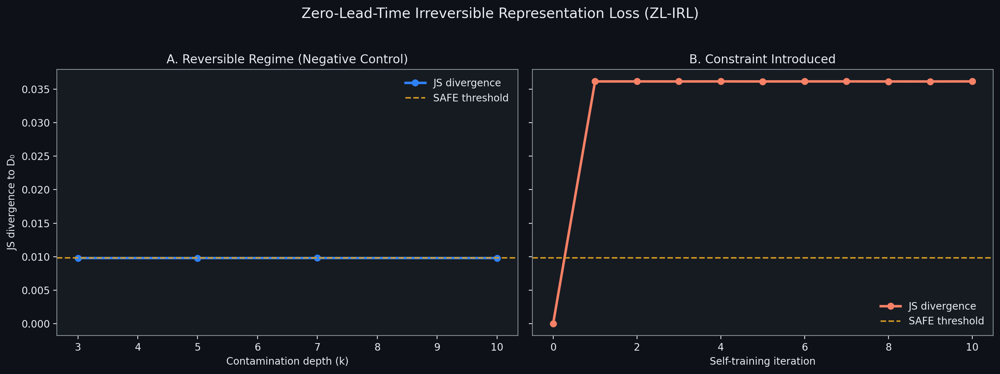
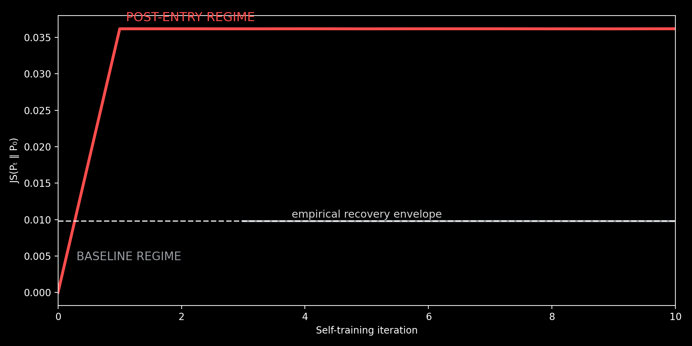

# Zero-Lead-Time Irreversible Representation Loss (ZL-IRL)

**Some learning-system failures are not approached.  
They are entered.**

This project establishes an empirical boundary case in which a self-training system undergoes **irreversible representational failure with zero detectable lead time**, rendering post-entry monitoring ineffective.

Zero-Lead-Time Irreversible Representation Loss (ZL-IRL) is not defined by the diagnostic transition itself, but by the **failure of recovery procedures applied after regime entry**.

---

## Formal Definition — Zero-Lead-Time Irreversible Representation Loss (ZL-IRL)

**Zero-Lead-Time Irreversible Representation Loss (ZL-IRL)** occurs when a deterministic preprocessing or representational constraint removes task-relevant information such that downstream training cannot asymptotically recover original performance, and **no monitoring signal can provide advance warning because the information required for detection is destroyed by the triggering transformation itself**.

Beyond a contamination threshold, retraining from clean data fails to restore lost distributional support, even when standard performance metrics remain stable.

This is irreversible representation loss.

---

## What This Project Actually Studies

Modern ML systems increasingly train on partially self-generated data.  
While catastrophic failure (“model collapse”) is often discussed, far less is understood about **silent distributional degradation** — shifts in data geometry that occur while surface behavior still appears acceptable.

This project asks a narrow, operationally critical question:

> **Can distributional diagnostics detect harmful self-training dynamics early — before surface metrics degrade and before recovery becomes difficult or impossible?**

Crucially, we do **not** assume:

- that collapse is inevitable  
- that irreversibility always occurs  
- that degradation implies failure  

Those outcomes are tested, not assumed.

---

## Core Result — A Boundary Failure Mode

In a memoryless self-training system, **degradation alone is reversible**.

However, when the system introduces a **deterministic representation constraint**, the system becomes path-dependent and exhibits **irreversible loss of distributional support with zero lead time**.

In this regime:

- the diagnostic transitions directly from **SAFE → HIGH_RISK**
- no statistically detectable WARNING regime exists
- recovery retraining converges to a degraded attractor
- post-entry monitoring cannot intervene

**Early warning is structurally impossible within this class of systems.**

---

## Impossibility Claim (Informal)

Any learning system that satisfies all of the following:

- memoryless training updates  
- deterministic representation truncation  
- self-generated data feedback  

**may exhibit irreversible failure with zero lead time**, rendering post-entry monitoring ineffective.

This work does **not** claim inevitability, universality, sufficiency, or applicability to stochastic drift or adaptive representation schemes.

---

### Epistemic Status & Scope

This result is empirical, not formal.

The impossibility claim applies to the class of systems instantiated in this work:
memoryless training updates with deterministic representation truncation and self-generated data feedback.

The claim is that **no precursor signal exists within the reversible envelope of this class**, not that no such signal could exist under different architectural or stochastic assumptions.

---

## What This Project Does *Not* Claim

This project explicitly does **not** claim:

- that self-training inevitably collapses models  
- that irreversibility is universal  
- that entropy always decreases monotonically  
- that these experiments simulate full-scale LLM training  

Negative results are preserved intentionally.

---

## Why This Matters (Systems Perspective)

In real ML infrastructure:

- you do not want to wait for collapse  
- you do not want to discover failure through incidents  
- you need to know when intervention is still possible  

This project reframes the problem from:

> “Do models collapse?”

to:

> **“When does a self-training system enter a risky regime — and is intervention still possible?”**

The answer is conditional.

And sometimes, the answer is **no**.

---

## Diagnostic Validity vs Intervention Possibility

This project distinguishes between:
- the ability to detect regime entry
- the ability to intervene after regime entry

Early-warning diagnostics are valid and effective **within the reversible regime**.

ZL-IRL shows that once deterministic representation truncation occurs, **intervention becomes impossible even though detection still occurs**.

The failure is not of monitoring, but of recoverability.

---

## Repository Structure

- `README.md` — final boundary result (this document)
- `experiments/README.md` — full experimental provenance
- `src/` — deterministic experimental code
- `figures/` — minimal, non-misleading visualizations

---

## Final Locked Conclusion

Silent distributional degradation can emerge under partial self-training even when training succeeds.

Conventional performance metrics are insufficient early indicators.

Recovery is possible under reset retraining.

Irreversibility is conditional and rare.

**When it occurs via deterministic representation truncation, it exhibits zero lead time.**

> The system forgets not because it trains on itself —  
> but because it is prevented from remembering what it once knew.